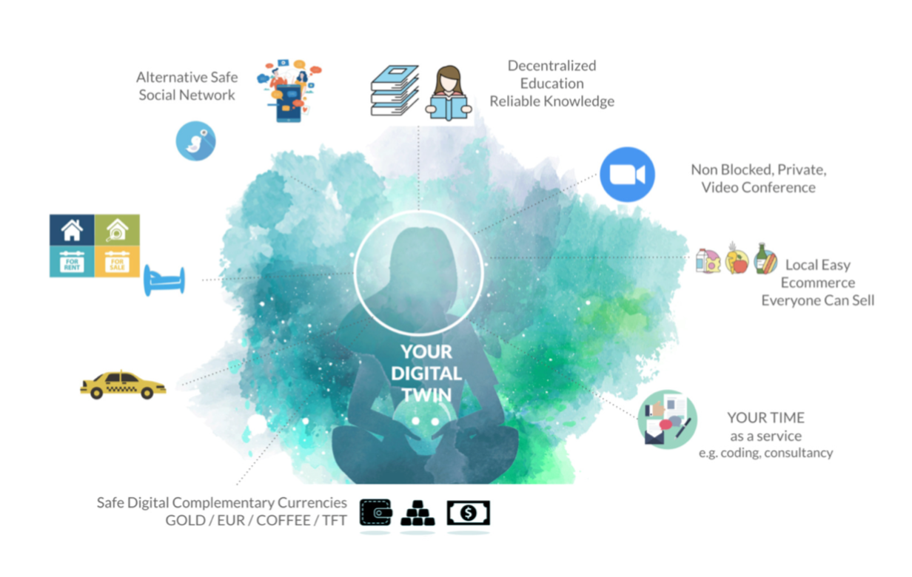

## What is a Digital Twin?

In the current Internet system, each of us exists many times, each application provider owns _our_ data while offering functionality _they_ own. We become the user. We become the product. Instead, what if we were at the center of our digital lives?

 
 
The Web4 Digital Twin architecture does just that: it puts us at the center of our digital experience. Indeed, Digital Twin is a user-centric technological platform to build efficient, sovereign and secure digital experiences. Digital Twin technology empowers people and businesses to exchange information and value without any intermediaries, while making applications more scalable, efficient and secure than on any other web paradigm such as Web2, Web3 or Web5. Digital Twins require a decentralized Internet infrastructure and run perfectly on top of the ThreeFold Grid.
 
## Your Digital Twin is a mirror of yourself!
 
Your Digital Twin runs on a location of your choice, which becomes your personal Internet Gateway. Each Twin is owned by only one owner, who in the end is more like the human mirror to the Twin. The Twin has lots of capabilities and is available for its “human mirror” 24 hours a day, 7 days a week. Experiences are being built which use the capabilities of the Twin. A Twin owns your data and your identity, all stored in such a way it can never be corrupted or lost. Thus, you own your data, your identity and your digital skills for all your life.
 
## Your Digital Twin has Capabilities
 
Twins are powerful and have many capabilities which are used when they enter an experience. Here are the capabilities of the Digital Twin:
 
* Communicate
   * Chat, video conference, send messages to anyone.
* Create
   * Create content, any content (metaverse, video, websites, ...)
* Share and Promote
   * Share your creations to the rest of the world
   * Promote your products and services
   * Share your knowledge and help others to grow
* Discover and Learn
   * Find information, alternative indexing engine (neutral)
   * Know what is truthful and what is not (proof of authenticity)
   * Learn and become smarter
* Economy
   * Manage my digital wealth (digital currencies)
   * Exchange anything for anything else (money for tokens, services, products)
   * Buy/Sell goods and services
* Collaborate
   * How can I collaborate on documents, images, videos, code, ...
   * How can I manage a project, plan events, define deadlines
* Organize
   * Manage your agenda and time
   * Organize your digital content so you can find it back, and it's nicely organized
   * Manage your circles (groups of people)
* Protect
   * Make sure that only the right people have access to your digital assets
   * What happens if you die, make sure your loved ones can inherit your digital assets
   * Make sure your digital life is secure (give access to your assets to your circles)
   * Give proof of authenticity to assets and information from others
* Develop and Expand
   * Code and extend the Twin (improve Twin capabilities for yourself and others)
   * Create your own experiences
 
 
 
The Twin has basic capabilities listed above which are strongly version controlled, but contributions from the global community are more than welcomed. The idea is to create a system which is simply good enough for any possible experience.
 
 
 

 
 
 
This is a very different paradigm compared to current web or mobile applications where capabilities are owned by the provider of the application. Besides, rather than survival of the fittest, we believe in a system of collaboration, where we invite everyone to make the system better so it fits us all. We don't need three chat systems, we need one which is usable by thousands of experiences.
 
 
 
Developers can create experiences re-using the open source capabilities the Twin offers, also eliminating the need to reinvent features.
 
## Note on Connection & Security
 
As a “user”, you can use any browser to access experiences built on top of your Digital Twin. For example, a storage experience that stores data on your Twin or a browser experience that allows you to surf the web from your Twin's node. When you connect to your Twin, our **[ThreeFold Connect](https://library.threefold.me/info/threefold#/web4/threefold__threefold_connect)** makes sure that the connection is secure. The Twin runs on a node on the ThreeFold Grid, which you are securely connected to. This takes care of a very safe approach and unlimited scalability. We will dive deeper into the Twin’s security and scalability aspects in a future blog!
 
## Digital Twin in a nutshell
 
Hopefully, by now you will have a better understanding of the Digital Twin concept. Here is a short recap of everything mentioned so far about it:
 
* You have full control over your own digital life.
* Experiences can be created using standard web & native technologies.
* The Digital Twin delivers the web interface to your (secure) browser.
* No need for information to travel to central data centers, all communication is fast and private between Digital Twins: No more client-server.
* All logic of your digital life is 100% private to you running in your Twin.
* This is super efficient and sustainable, +10x power savings.
* No blockchain required for your digital life = more privacy, performance, green
   * Exception: blockchain is needed for digital currencies and as a phone book for Digital Twin’s identity.
 
 
 
If you would like to see what the current iteration of the Digital Twin looks like, [try it out](https://demo.freeflow.life/) yourself with [FreeFlow Twin](https://freeflow.life/) in its current beta version! Connect with ThreeFold on [Twitter](https://twitter.com/threefold_io), [Telegram](https://t.me/threefold), [LinkedIn](https://www.linkedin.com/company/threefold-foundatiooon/), and [Reddit](https://reddit.com/r/threefold) to join our community and stay updated about evolutions of the ThreeFold project and Digital Twin.
