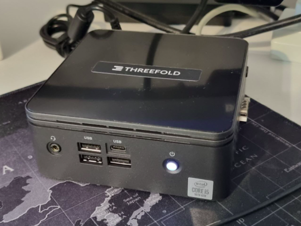

ThreeFold farming refers to the act of connecting a 3Node to the ThreeFold Grid – providing Internet capacity to a globally distributed peer-to-peer Internet infrastructure. Farming is a decentralized and energy-efficient way for people to expand a new Internet infrastructure instead of corporations building hyper-scale data centers. It’s also a way to extend the Internet to underserved regions of our planet, which cannot afford data centers. Every ThreeFold Farmer around the world contributes to the growth of the foundation for a self-sovereign, private and secure digital world.

 

 

Anyone can start farming by hosting a computer at their home or office and taking part in the decentralization of our global Internet and Cloud economy.

## Why become a ThreeFold Farmer?

Today’s Internet model is highly centralized, owned and operated by the few. It has turned people into products, is too harmful for our planet, cannot scale to meet emerging demands and connect the billions who are being left behind. These alone are powerful reasons to participate in ThreeFold farming and participate in the growth of a new peer-to-peer Internet economy.

 

Further, the Internet is the second largest and fastest growing industry in the world after the financial markets. With the Internet expected to triple in size by 2025 to meet the data requirements of emerging technologies such as blockchain, Web3 and IoT, we need more capacity and especially in underserved regions of the world.

## Basics of ThreeFold Farming

ThreeFold is a peer-to-peer network of computers (known as “3Nodes”), including servers, desktops and laptops, that creates an open-source, decentralized Internet. People who connect computers to the ThreeFold Grid (known as “farmers”) are rewarded with ThreeFold Tokens (TFT) on a monthly basis for meeting the required uptime necessary for users to access their workloads.

 

The process of connecting decentralized Internet capacity and thereby creating new ThreeFold Tokens is described as farming because it resembles the process of farming in agriculture. With agricultural farming, farmers cultivate the land and earn revenue from their harvests. With ThreeFold, farmers connect decentralized Internet capacity and earn ThreeFold Tokens every month for achieving a certain uptime.

 

The above model represents the building block for a distributed, edge infrastructure that can scale to anywhere electricity and network exists, to meet emerging data demands while also providing the self-sovereignty, privacy and security features to achieve true net-neutrality.

## A Fair Economic Model

ThreeFold was created to realize the promise of an open-source, peer-to-peer Internet. As such, ThreeFold farming rewards all farmers equally according to the amount of Internet capacity they provide to the network.

 

ThreeFold Tokens are rewarded for the amount of Internet capacity added and kept connected to the network. [Farming rewards](https://library.threefold.me/info/threefold#/tfgrid/farming/threefold__farming_reward) are calculated according to the compute, storage and network capacity made available by the computers:

 

- 30 TFT per Compute Unit (2 vCPU and 4 GB memory) per month
- 12.5 TFT per Storage Unit (1 TB of SSD and HDD) per month
- 0.38 TFT per Network Unit (1 GB of data transfer)
- 0.06 TFT per public IP address per hour 

 

The above prices are based on the price of 1 TFT equalling $0.08. The farming rewards are pegged to the U.S Dollar and the price is locked from the time a farmer gets started to incentivize early contributors to the network. When the price of TFT rises, the farming rewards will decrease.

 

Farming rewards are designed to be “reviewed” by [the ThreeFold DAO](https://library.threefold.me/info/threefold#/decentralization/dao/threefold__tfdao) (a decentralized autonomous organization owned by the ThreeFold community) according to the growth of the ThreeFold Grid and the utilization of its decentralized cloud to ensure a fair distribution of the token economy while also ensuring that farmers will always be justly rewarded for their contribution.

## An innovative and sustainable solution

Bitcoin mining and other blockchains became famous for requiring enormous amounts of computers and power to solve complex mathematical equations to win the chance of earning the famous cryptocurrency. Since then, many other projects have been born and carried on the mining concept.

 

ThreeFold’s model is inclusive and planet-friendly. The decentralized operating system built and used by ThreeFold is extremely lightweight, allowing the peer-to-peer Internet infrastructure to be up-to 10x more energy efficient than the data center model and up-to 100x more energy efficient than Bitcoin mining.

 

The infrastructure was built in such a way that it removes the need for human intervention or maintenance to eliminate all unnecessary backdoors that open the possibility for ransomware and cyberattacks. Once booted, the decentralized operating system runs forever as the whole infrastructure was designed to be self-driving and self-healing. This 100% autonomous model allows for a completely decentralized system while also enhancing the security and privacy.

 

While blockchain remains an incredible store of value, it is neither an efficient nor a scalable solution to store data and run applications. Only a peer–to-peer model can scale the Internet infinitely and efficiently.

## Considerations before getting started

The following are important factors to consider for ThreeFold farming profitability: 

### Computer Hardware

Farmers are encouraged to use the latest computers, including servers, desktops, and laptops that come with an AMD and Intel processor. The computer should have at least 1 Terabyte of SSD to optimize the performance of their farming activity. It is recommended to buy a ThreeFold 3Node server from certified partners around the globe that comes pre-configured and ready to run on the Grid. 

 

Used or refurbished computers can be used but it is important to understand that older computers are less efficient and more power-hungry. Computers not older than 4 years are recommended. Please visit [the DIY section of our forum](https://forum.threefold.io/c/farming/diy-farming/43) for support and feedback on farming setups.

### Power Costs

Electrical power is the  main operating expense. Electricity is charged per kilowatt-hour (kWh). The cost of farming can float from $0.10 to $0.35 per kWh. It is important for a farmer to verify the expected power usage of a computer before starting the operation to improve profitability.

 

*Note that the price of kWh varies depending on the country. Find a country power cost average comparison [here](https://www.electricrate.com/data-center/electricity-prices-by-country/).*

### ThreeFold Token Price

An incentive to farm ThreeFold Tokens is because of its future potential. What Bitcoin did to money, ThreeFold is doing to the Internet. While Bitcoin and Etheruem have already reached high market caps, ThreeFold is just getting started.

 

Farmers are rewarded a given amount of TFT monthly based on the amount of Internet capacity they provide to the network.

 

If the price of TFT is $0.1, the profitability of the farm will be average. If the price of TFT is $0.3  your farming operation may operate with healthy rewards. If the price of TFT is $1 your farming operation will be highly rewarding.

 

Farming rewards are also locked until 30% utilization for a period of 2 years to incentivize early participants. The earlier you start your farming operation, the greater the rewards along with the growth in the value of TFT.

 

The right mix of the above elements make farming an attractive venture. If the variables are favorable, farmers can scale up operations and earn more rewards.

## Conclusion

Anyone can start farming by hosting a computer at their home or office and take part in the decentralization of our global Internet and Cloud economy. Considering ThreeFold’s market cap alongside the growing demand for a decentralized Internet, there’s no better time than now to get started farming!

 

[Buy](https://shop.threefold.tech/) or [build](https://manual.grid.tf/farmers/3node_building/3node_building.html) a 3Node and become a ThreeFold Farmer!